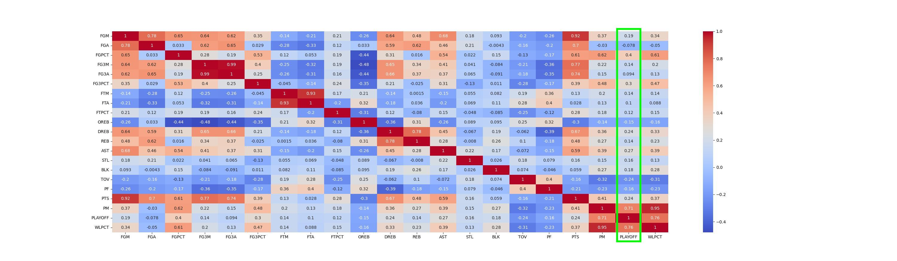

# NBA Playoff Prediction Algorithm (MIDTERM)

## Introduction/Background:

The NBA is the world’s most competitive professional basketball league and each of its 30 teams try to win the NBA championship every season. Our project goal is to create a model to accurately predict which NBA teams have the best chance to make the NBA playoffs and win the championship. Our team is looking to use machine learning to predict the end ranking of teams by the halfway point, and find common traits in success so that teams can know what to improve to make the playoffs, or what they need to do to remain in the playoff picture.

## Problem Definition:

NBA teams all want to make the playoffs to get a chance to win an NBA championship, but teams would like to know where they stand in relation to the rest of the teams in their respective conferences at the half point of the season. Our team is looking to use machine learning to predict the ranking of all teams at the end of the season so that in the middle of the season, teams know what they need to do to get into the playoffs, or what they need to do to stay in the playoffs.

## Data Collection:

Our data on a team's average statistics is from this [Kaggle dataset](https://www.kaggle.com/datasets/wyattowalsh/basketball/discussion), which has multiple different CSV’s for different basketball statistics. One of the CSV’s that we will use is the `game.csv` file which has information on all basketball games since 1946 and until January 2023. We downloaded this CSV from the Kaggle website and then used data processing to clean the data and only keep the years and features we need to train our models.

The Kaggle dataset we are using for season averages for teams does not include any data on whether or not a team made the playoffs. We need this data in train and test our models, so we decided to pull playoff data from [Basketball Reference](https://www.basketball-reference.com/), which we extracted through a web data scraper.

Additionally, the Kaggle dataset had no distinguishment between teams in the Eastern and Western Conferences, which have separate scheduling rules and playoffs. As a result, we decided to divide the Kaggle dataset into East and West subdatasets to run the algorithm on.

## Methods:

### Data Cleaning/Pre-processing

#### Relocated/Expanded Teams
There were a few issues with the dataset in handling teams that moved cities and/or conferences, but Kaggle included a 'team_id' column which was used in querying to keep consistent with present day team names. 

##### Charlotte/New Oreleans
A particularly difficult situation emerged as Charlotte was an eastern conference team in 2000, 2001, 2002, and 2003. It changed to New Orleans for 2004, 2005 but stayed in eastern conference. We removed the 2005 season's data due to midseason shift to a new city/conference but in 2004 New Orleans (NOP) was shifted to the east and the first few years only have 29 teams up until the expansion.

#### Feature Extraction (Mid-Season Averages)
In the Kaggle dataset, we had a multi-step process for creating the statistical averages for each team at the midpoint of every season:
1. We first took a dataframe including every game from the 2000 season until 2022. 
2. We then divided it into 30 dataframes of each team's total games from 2000 to 2022. 
3. We divided each team's games into their respective seasons .
4. We then took the average of the first 41 games (first half) for each season. (NOTE: Since Kaggle did not have statistics for W/L%, we replaced the dataset's Win/Loss column values ('W', or 'L') with an int 1/0 that could be numerically averaged into a Win-loss percentage, and the Home/away location into an int 1/0 as well. 
5. Afterwards, we merged each of the season's team averages into separate east and west dataframes. The result was a dataframe for the east and west teams' statistical averages after half of the season had finished.
6. We sorted teams alphabetically (to stay consistent with the ordering for the playoff data from [Basketball Reference](https://www.basketball-reference.com/), and created a training set of data using seasons 2000-2019, and a testing set of data from 2020-2022.

  Features we parsed and kept from the Kaggle dataset:
  - Win-loss percentage (WLPCT)
  - Home versus away game ratio (MATCHUP)
  - Field goal makes (FGM)
  - Field goal attempts (FGA)
  - Field goal percentage (FGPCT)
  - 3 point field goal makes (FG3M)
  - 3 point field goal attempts (FG3A)
  - 3 point field goal percentage (FG3PCT)
  - Free throw makes (FTM)
  - Free throw attempts (FTA)
  - Free throw percentage (FTPCT)
  - Offensive rebounds (OREB)
  - Defensive rebounds (DREB)
  - Rebounds (REB)
  - Assists (AST)
  - Steals (STL)
  - Blocks (BLK)
  - Turnovers (TOV)
  - Personal fouls (PF)
  - Points (PTS)
  - Plus-minus points differential (PM)

#### Feature Selection
We experimented with some backwards feature selection, particularly by removing some features that we believed to be less relevant (i.e. 'TEAM', 'YEAR', and 'MATCHUP' ratio, although we re-included 'MATCHUP') in order to see if it led to better results. We plan in the coming weeks to continue with backwards feature selection using research to determine what statistics are less relevant. We also plan to expand to include some additional features, using advanced metrics such as true shooting percentage, defensive efficience, etc. to see if those may also help with our model performance.

### Training Models

Thus far, we have created two models for predicting which NBA teams will be making the playoffs for any given season: a logistic regression model and a support vector machine (SVM) model.

For both our logistic regression and SVM models, we proceeded with the same following steps. We used the mid-season averages for each team from the years 2000 (1999-2020 season) to 2020 (2019-2020 season) as the training data. We used the mid-season averages for each team for the 2021 and 2022 seasons as training data for predicting the 2021 and 2022 playoffs, respectively. 

So far, we have ran the models on all features in our dataset including WLPCT, MATCHUP, FGM, FGA, FGPCT, FG3M, FG3A, FG3PCT, FTM, FTA, FTPCT, OREB, DREB, REB, AST, STL, BLK, TOV, PF, PTS, PM. We omitted the TEAM and YEAR features because they do not have an impact on the performance of the team itself.

## Results and Discussion:

### Visualizations

While creating our dataset we decided to run some visualizations to get an understanding of how the data is trending. Our next couple visualizations helps show a difference in many key features from playoff bound teams and non-playoff bound teams. 

RED indicates playoff clinch
BLUE indicares playoff miss

Below we see 3 charts, Field Goals Attempted by year for the East, Field Goals Attempted by year for the West & Field Goals Attempted by year for the East and West. Pre-2010 we see FGA fluctuate but mainly stay within its bounds. We have a couple outliers with teams experimenting different playing styles, which start to pick up in the coming years. As we look at the early 2010s, the FGAs start to increase but it isn't till around 2018 when the overall league average for FGA jumps. Infact within the 2020 season, most of the teams FGAs are above the teams from the 2000s. However when we look at the playoff clinching factor, there's no clear pattern for more Field Goals Attempted equating to making the playoffs.

Next, we explore how Field Goal Percentage for each team has an impact on those who make and dont make the playoffs. The next 3 charts are Field Goal Percentage by year for the East, Field Goal Percentage by year for the West & Field Goal Percentage by year for the East and West. Examining the FG%s by year, both the east and the west are a bit chaotic and a clear distinction can not be made pre-2010, however once we get past the 2010s, every year most of the teams that make the playoffs, have higher FG%s relative to those who were not able to make the playoffs. 

This sparked some thought as we wanted to explore if 3pt shots had any indictor of making the playoffs. We explore 3 point field goal attempts (FG3A) & 3 point field goal percentage (FG3PCT) for the east and west in the next coupld of graphs. This has shown us that for the league, there has been a general increase in the last 10 years in FG3A, but not a huge differenciater for playoff success. We see a similar trend in FG3PCT as well. We see that in FG3PCT, the range of values becomes more narrow as time goes on and generally that there is no clear distinction in teams that make it to the playoffs based on this particular feature.

Moving onto the Defensive ability of a team, we would like to compare their Block and steals stats with those who made and did not make the playoffs. 
The next couple graphs explore this avenue. Overall, we see that for Blocks and Steals we have a very small subtle difference between those teams that make it compared to those that dont. While this could be a factor as to teams make the playoffs, this does not seem like the biggest driving force. 

Below, we look at how rebounds have an impact on a team's playoff success. In the earlier years, we see that there was a distinction with a couple of outliers, but as time moved forward, it became less definitive. Teams with a lot of rebounds didnt necessarily make the playoffs and those teams with less rebounds could still make it. Overall, currently, rebounds are not a good indicator of playoff sucess. 

We wanted to see how Plus-minus points differential (PM) and Win-loss percentage (WLPCT) changed with time. We saw that both these factors were a clear indicator of Playoff attainment success. Regarding PM, there is a pretty clean cut at the 0 point with teams who have a Positive differencal, generally make the playoffs while those with negative differencials end up missing the playoffs. A similar distinction is made in Win-loss with teams higher than .5 end up making the playoffs and those who have a negative record end up missing the playoffs. 

In this plot, we compare 3 factors with eachother, WLPCT, PM & FGPCT.  We see that teams who did not make it tend to have negative WLPCT & PM and a lower FGPCT on the left of the chart, while teams who did make it tend to have positive WLPCT & PM and a higher FGPCT on the right of the chart. These are our top 3 indicators of playoff attainment success.

### Model Results

#### Logistic Regression Model for 2021 Eastern Conference

|NUMBER| TEAM | PLAYOFF | PREDICTION | PROBABILITY|
|-------------|-------------|-------------|-------------|-------------|
|12  |PHI        |1           |1     |0.997403|
|1   |BKN        |1           |1     |0.997387|
|9   |MIL        |1           |1     |0.997174|
|0   |ATL        |1           |1     |0.939988|
|7   |IND        |0           |1     |0.912472|
|13  |TOR        |0           |1     |0.845891|
|2   |BOS        |1           |1     |0.839305|
|8   |MIA        |1           |1     |0.813625|
|3   |CHA        |0           |1     |0.776989|
|10  |NYK        |1           |1     |0.748290|
|4   |CHI        |0           |1     |0.698376|
|14  |WAS        |1           |0     |0.331704|
|6   |DET        |0           |0     |0.220183|
|11  |ORL        |0           |0     |0.097384|
|5   |CLE        |0           |0     |0.066688|

#### SVM Model for 2021 Eastern Conference

|NUMBER|TEAM  |PLAYOFF  |PREDICTION   |PROBABILITY|
|-------------|-------------|-------------|-------------|-------------|
|1   |BKN        |1           |1  |1.000000e+00|
|9   |MIL        |1           |1  |1.000000e+00|
|12  |PHI        |1           |1  |1.000000e+00|
|0   |ATL        |1           |1  |1.000000e+00|
|7   |IND        |0           |1  |9.999999e-01|
|13  |TOR        |0           |1  |9.999874e-01|
|2   |BOS        |1           |1  |9.974219e-01|
|8   |MIA        |1           |1  |9.964594e-01|
|10  |NYK        |1           |1  |9.751177e-01|
|3   |CHA        |0           |1  |9.674145e-01|
|4   |CHI        |0           |0  |3.175295e-01|
|14  |WAS        |1           |0  |6.718422e-04|
|6   |DET        |0           |0  |1.458999e-04|
|11  |ORL        |0           |0  |1.156647e-06|
|5   |CLE        |0           |0  |1.963654e-07|

#### Logistic Regression Model for 2021 Western Conference

|NUMBER|   TEAM  |PLAYOFF  |PREDICTION  |PROBABILITY|
|-------------|-------------|-------------|-------------|-------------|
|14  |UTA        |1           |1     |0.988914|
|10  |PHX        |1           |1     |0.984372|
|5   |LAL        |1           |1     |0.983565|
|4   |LAC        |1           |1     |0.977341|
|1   |DEN        |1           |1     |0.970961|
|6   |MEM        |1           |1     |0.816397|
|11  |POR        |1           |1     |0.791275|
|13  |SAS        |0           |1     |0.768273|
|0   |DAL        |1           |1     |0.749100|
|2   |GSW        |0           |1     |0.697789|
|8   |NOP        |0           |1     |0.672540|
|12  |SAC        |0           |0     |0.305724|
|9   |OKC        |0           |0     |0.095603|
|7   |MIN        |0           |0     |0.031277|
|3   |HOU        |0           |0     |0.022469|

#### SVM Model for 2021 Western Conference

|NUMBER|   TEAM  |PLAYOFF  |PREDICTION   |PROBABILITY|
|-------------|-------------|-------------|-------------|-------------|
|1   |DEN        |1           |1  |1.000000e+00|
|4   |LAC        |1           |1  |1.000000e+00|
|5   |LAL        |1           |1  |1.000000e+00|
|10  |PHX        |1           |1  |1.000000e+00|
|14  |UTA        |1           |1  |1.000000e+00|
|6   |MEM        |1           |1  |9.999915e-01|
|13  |SAS        |0           |1  |9.714620e-01|
|0   |DAL        |1           |1  |9.612282e-01|
|11  |POR        |1           |1  |9.572791e-01|
|2   |GSW        |0           |1  |8.828647e-01|
|8   |NOP        |0           |1  |7.593466e-01|
|12  |SAC        |0           |0  |6.203786e-04|
|9   |OKC        |0           |0  |1.677006e-06|
|3   |HOU        |0           |0  |1.000000e-07|
|7   |MIN        |0           |0  |1.000000e-07|

#### Logistic Regression Model for 2022 Eastern Conference

|NUMBER|   TEAM  |PLAYOFF  |PREDICTION  |PROBABILITY|
|-------------|-------------|-------------|-------------|-------------|
|4   |CHI        |1           |1     |0.985217|
|1   |BKN        |1           |1     |0.979093|
|9   |MIL        |1           |1     |0.974610|
|12  |PHI        |1           |1     |0.973028|
|8   |MIA        |1           |1     |0.956070|
|5   |CLE        |0           |1     |0.949933|
|3   |CHA        |0           |1     |0.933821|
|2   |BOS        |1           |1     |0.834638|
|14  |WAS        |0           |1     |0.735182|
|0   |ATL        |1           |1     |0.719648|
|13  |TOR        |1           |1     |0.709419|
|10  |NYK        |0           |1     |0.600157|
|7   |IND        |0           |1     |0.512018|
|6   |DET        |0           |0     |0.013121|
|11  |ORL        |0           |0     |0.007647|

#### SVM Model for 2022 Eastern Conference

|NUMBER|   TEAM  |PLAYOFF  |PREDICTION   |PROBABILITY|
|-------------|-------------|-------------|-------------|-------------|
|4   |CHI        |1           |1  |1.000000e+00|
|12  |PHI        |1           |1  |1.000000e+00|
|9   |MIL        |1           |1  |1.000000e+00|
|1   |BKN        |1           |1  |1.000000e+00|
|8   |MIA        |1           |1  |1.000000e+00|
|5   |CLE        |0           |1  |1.000000e+00|
|3   |CHA        |0           |1  |1.000000e+00|
|2   |BOS        |1           |1  |9.972652e-01|
|13  |TOR        |1           |1  |9.782052e-01|
|14  |WAS        |0           |1  |8.719598e-01|
|0   |ATL        |1           |1  |7.796768e-01|
|10  |NYK        |0           |1  |6.882436e-01|
|7   |IND        |0           |0  |5.381694e-02|
|6   |DET        |0           |0  |1.000000e-07|
|11  |ORL        |0           |0  |1.000000e-07|

#### Logistic Regression Model for 2022 Western Conference

|NUMBER|   TEAM  |PLAYOFF  |PREDICTION  |PROBABILITY|
|-------------|-------------|-------------|-------------|-------------|
|10  |PHX        |1           |1     |0.994681|
|14  |UTA        |1           |1     |0.989087|
|2   |GSW        |1           |1     |0.987890|
|6   |MEM        |1           |1     |0.964283|
|5   |LAL        |0           |1     |0.773361|
|1   |DEN        |1           |1     |0.730809|
|0   |DAL        |1           |1     |0.586451|
|13  |SAS        |0           |1     |0.530227|
|4   |LAC        |0           |1     |0.506697|
|7   |MIN        |1           |0     |0.383722|
|11  |POR        |0           |0     |0.226017|
|12  |SAC        |0           |0     |0.162125|
|8   |NOP        |1           |0     |0.079964|
|9   |OKC        |0           |0     |0.015447|
|3   |HOU        |0           |0     |0.014687|

#### SVM Model for 2022 Western Conference

|NUMBER|   TEAM  |PLAYOFF  |PREDICTION   |PROBABILITY|
|-------------|-------------|-------------|-------------|-------------|
|2   |GSW        |1           |1  |1.000000e+00|
|10  |PHX        |1           |1  |1.000000e+00|
|14  |UTA        |1           |1  |1.000000e+00|
|6   |MEM        |1           |1  |1.000000e+00|
|1   |DEN        |1           |1  |9.884713e-01|
|5   |LAL        |0           |1  |9.494208e-01|
|0   |DAL        |1           |1  |8.750574e-01|
|13  |SAS        |0           |0  |1.945591e-01|
|4   |LAC        |0           |0  |1.093770e-01|
|7   |MIN        |1           |0  |1.728664e-02|
|11  |POR        |0           |0  |1.126423e-04|
|12  |SAC        |0           |0  |2.206874e-05|
|8   |NOP        |1           |0  |1.263066e-06|
|3   |HOU        |0           |0  |1.000000e-07|
|9   |OKC        |0           |0  |1.000000e-07|

### Model Analysis

The best performing models were the SVM models for both the 2021 and 2022 seasons for the Western Conference. The training and testing accuracies were both greater than 0.85 for both of these models. The best performing logistic regression model was for predicting the Western Conference playoffs in the 2021 season, with training and testing accuracies greater than 0.80 for the model. We are unsure as to why the models for predicting the Western Conference playoffs are more accurate than the Eastern Conference playoffs, and it is something we will look into for the final report.

We also calculated what the most important features were in predicting the playoffs for each conference and each season and the top two features across all models for each season were high WLPCT and high PM ratio. This both makes sense intuitively and also matches the analysis from our visualizations of the WLPCT and PM statistics. Teams with above 0.500 WLPCT and a positive PM ratio often make the playoffs while teams with the opposite tend to miss the playoffs. Other important features include high FGPCT, high STL, low TOV, and high FGA. This also matches the analysis from our visualizations as we see that teams with high FGPCT and FGA and better defensive statistics are more likely to make the playoffs.

The rest of our logistic regression and SVM models predict more playoff teams than there should be due to overfitting. We know that our models are overfitting the playoff predictions because the calculated training accuracy scores are greater than the testing accuracy scores for our models. In order to improve on the accuracy of our models, we plan on testing out different splits of training and testing data. So far, we have only trained our models on years 2000-2020 and tested our models on 2021 and 2022, and these splits may be too large. We plan on testing other percentages with closer splits for training and testing data using scikit-learn’s “train_test_split” function. We could also potentially add more seasons to our dataset for more data to train and test our models with. However, this can potentially be detrimental to the accuracy of our models because older seasons of the NBA, especially before 2000, have different numbers of teams and different play styles, so the predictions might not be consistent.

### Feature Correlation Matrix

The correlation matrix tells us about the relationship between the different features in the dataset. It quantifies the strength of the relationship between various features and the direction of their relation (positive or negative). Our main objective to construct the matrix is to find the features that are affecting the chance of a team making the playoffs, thus, our target variable will be the number of points scored by the team (PTS). We chose this as the target variable as the number of points scored would be a good indicator of whether the teams would make the playoffs or not.

To analyze our matrix, we set a threshold of 0.35 to show a fairly important relation between the feature and the points scored by that team. The column that we will be focusing on has been highlighted with a box around it in light green. There are certain features that fall below the threshold: PF, TOV, OREB, BLK – indicating that these features do not have a very strong relation with the number of points scored by the team, and thus these features do not play a very crucial role in our models. On the other hand, there are other features like FGM, FGA, FG3M which have a high positive relation with the number of points scored by a team, indicating that these are important features that we would like to focus our models around.

In general, the feature correlation matrix helped narrow down the features that we would focus on, simplifying some of our models and helped us gain a greater understanding about the underlying patterns in the dataset.

### Confusion Matrix

The confusion matrices were provided for four different models: Logistic Regression, SVM, Decision Tree, and Random Forest. Each matrix showed the performance of the model in predicting whether a team would make the playoffs or not, based on the known truth (actual results) for the years 2021 and 2022.

After analyzing the confusion matrices, evaluation metrics such as accuracy, precision, recall, and F1-score were calculated for each model. The accuracy represents the ratio of correct predictions to the total number of samples. Precision measures the percentage of correct positive predictions out of all positive predictions made by the model. Recall measures the percentage of true positive predictions out of all actual positive samples. The F1-score is a harmonic mean of precision and recall.

For Logistic Regression:

  
  
  Accuracy = (11+31)/(11+17+1+31) = 0.73
  Precision = 11/(11+1) = 0.92
  Recall = 11/(11+17) = 0.39
  F1-score = 2 * (precision * recall) / (precision + recall) = 0.54
For SVM:

  
  
  Accuracy = (12+31)/(12+16+1+31) = 0.75
  Precision = 12/(12+1) = 0.92
  Recall = 12/(12+16) = 0.43
  F1-score = 2 * (precision * recall) / (precision + recall) = 0.58
For Decision Tree:

  
  
  Accuracy = (19+27)/(19+9+5+27) = 0.78
  Precision = 19/(19+5) = 0.79
  Recall = 19/(19+9) = 0.68
  F1-score = 2 * (precision * recall) / (precision + recall) = 0.73
For Random Forest:

  
  
  Accuracy = (17+30)/(17+11+2+30) = 0.81
  Precision = 17/(17+2) = 0.89
  Recall = 17/(17+11) = 0.61
  F1-score = 2 * (precision * recall) / (precision + recall) = 0.72
  
Based on the calculated metrics, the Random Forest model showed the best performance with the highest accuracy, precision, and F1-score. Therefore, it can be concluded that the Random Forest model is the best model to use in predicting whether a team would make the playoffs or not.

### Future Work

To further improve our existing models, we would like to use different sets of features when training and testing. Currently, we are only testing our models with all features as mentioned above. We would like to use feature reduction algorithms to reduce features that do not have a great impact on a team's chances of making the playoffs halfway into the season. For example, one feature that may not have an impact on a team’s chances of making the playoffs is the “MATCHUP” feature which calculates the ratio of home to away games that a team has played. This ratio is largely consistent for all teams throughout the season and is not likely to be a factor that we need to include in our models.

We also plan on trying other supervised learning models including K-Nearest Neighbor classification and Random Forest classification models to see if these models can predict the playoffs with higher accuracy.

## Scholarly References:

Kohli, Ikjyot Singh. “Finding Common Characteristics among NBA Playoff Teams: A Machine Learning Approach.” SSRN Electronic Journal, 2016, https://doi.org/10.2139/ssrn.2764396.

Ma, Nigel. “NBA Playoff Prediction Using Several Machine Learning Methods.” 2021 3rd International Conference on Machine Learning, Big Data and Business Intelligence (MLBDBI), Dec. 2021, https://doi.org/10.1109/mlbdbi54094.2021.00030. 

Wang, Jingru, and Qishi Fan. “Application of Machine Learning on NBA Data Sets.” Journal of Physics: Conference Series, vol. 1802, no. 3, 1 Mar. 2021, p. 032036, https://doi.org/10.1088/1742-6596/1802/3/032036. 

## Contributions

Samuel: Was in charge of later data cleaning and processing, such as troubleshooting issues with conferences/team relocations, averaging the teams' midseason stats, and reshaping to be compatible with the learning models. Helped with the implementation of the models by fixing any errors that could be dealt with on the data side such as mismatching rows, incorrect labeling, etc. and contributed in writing the 'Data Collection' and 'Methods' sections of this report.

Divyesh: Was in charge of the early data cleaning and processing. Experimented different techniques of cleaning ans storing data: by year or by team. Parsed through the game.csv file and took the 2000-2022 seasons and split into each team's games. Also helped with the creation and debugging of SVM and logistic regression models. 

Avi: Was in charge implementing the logistic regression and SVM models to predict playoff results based on midseason averages. Calculated predictions for playoffs, most important features, and model accuracy scores using the logistic regression and SVM models. Was critically important in communicating any issues with the dataset that needed fixing, as well as helping interpret results for the analysis and graphs. Contributed to the model analysis and future work portions of the "Results and Discussion" section of this report.

Param: Was in charge of creating the visuals and the explanations for why these visuals are useful and what we will learn from them. Through this analysis, we gained a better understadning as to our goals/aims for the coming months. Was a huge contributor of writing the visualization portion of the "Results and Discussion" section of this report.

Saahas: Was in charge of creating the python code for the visuals and helped with the explanations for why these visuals are useful and what learned from them. Created all the scatterplots and the 3-D graphs using matplotlib. Assisted with writing the visualization portion and the model results portions of the "Results and Discussion" section of this report, as well as helping interpret the results from the analysis and the plots.

